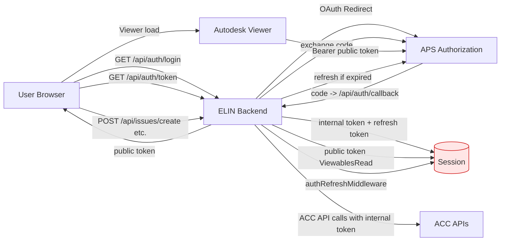

# ELIN Viewer Security Konzept

Stand: 2026-03-19

## Ziel und Scope

Dieses Dokument beschreibt das Sicherheitskonzept fuer die Anmeldung an Autodesk Platform Services (APS) und Autodesk Construction Cloud (ACC) im ELIN Viewer.

Scope:
- Login und Session-Management
- Token-Verwaltung
- Autorisierung fuer Viewer und ACC-Operationen
- Sicherheitsrisiken und Hardening-Massnahmen

## Architekturueberblick

Der ELIN Viewer nutzt einen serverseitigen OAuth-Flow (3-legged) mit Trennung zwischen:
- Public Token (nur Viewer-Lesen)
- Internal Token (ACC/DM Schreib-Lese-Funktionen)

Relevante Implementierung:
- routes/auth.js
- services/aps.js
- config.js
- server.js

## Authentifizierungsfluss

1. Browser ruft `GET /api/auth/login` auf.
2. Backend leitet zu APS Authorization weiter.
3. APS liefert Authorization Code an `GET /api/auth/callback`.
4. Backend tauscht Code gegen Internal Access Token + Refresh Token.
5. Backend erzeugt daraus Public Viewer Token mit reduziertem Scope.
6. Session speichert Public/Internal/Refresh Token sowie Ablaufzeit.
7. Bei geschuetzten Endpunkten prueft `authRefreshMiddleware` Ablauf und refresht bei Bedarf.

## Token-Modell und Scopes

Aktuelle Scopes laut Konfiguration:
- Internal: DataRead, DataWrite, DataCreate, ViewablesRead
- Public: ViewablesRead

Sicherheitsprinzip:
- Least Privilege fuer Frontend (nur Public Viewer Token)
- Sensitive ACC-Aufrufe nur ueber Backend mit Internal Token

## Session- und Cookie-Verhalten

Aktueller Zustand:
- Session via `cookie-session`
- Tokens werden in Session-Daten gehalten
- maxAge aktuell 24h

Wichtig:
- Bei `cookie-session` liegen Session-Daten clientseitig im Cookie (signiert, aber nicht vollwertig serverseitig isoliert).
- Fuer Refresh-Tokens ist serverseitige Session-Speicherung sicherer.

## Schutzmechanismen im aktuellen Stand

- OAuth Client Secret bleibt serverseitig.
- Token Refresh zentral im Backend.
- Ohne Session/Token werden geschuetzte Endpunkte mit 401/Fehler beendet.
- Public Token wird getrennt fuer Viewer ausgeliefert.

## Risiken

1. Refresh Token in Cookie-Session
- Risiko: Sensitivere Daten liegen in signiertem Client-Cookie.
- Auswirkung: Erhoehtes Exposure-Risiko bei Session-Leak.

2. Fehlende explizite Cookie-Haertung im Session-Setup
- Risiko: Default-Einstellungen sind evtl. nicht streng genug.
- Auswirkung: Hoeheres Risiko fuer Session-Missbrauch.

3. Scope-Drift
- Risiko: Internal Scopes bleiben zu breit fuer einzelne Features.
- Auswirkung: Unnoetig hoher Berechtigungsumfang bei Missbrauch.

## Hardening Empfehlungen (priorisiert)

### P1 - Session auf serverseitigen Store umstellen

Empfohlen:
- `express-session` mit Redis oder DB-Store
- Refresh Tokens nur serverseitig speichern

### P1 - Cookie-Haertung aktivieren

Empfohlen:
- `httpOnly: true`
- `secure: true` (in HTTPS-Umgebung)
- `sameSite: "lax"` oder `"strict"`
- kurze, begruendete Session-Lebensdauer

### P2 - CSRF-Schutz fuer state-aendernde Endpunkte

Empfohlen fuer:
- POST/PUT/DELETE Endpunkte (z. B. issues/create, markups/create, stamps/save)

### P2 - Scope-Review pro Feature

Empfohlen:
- Regelmaessig pruefen, ob `DataWrite`/`DataCreate` fuer alle Flows notwendig sind.
- Minimal erforderliche Scopes dokumentieren.

### P3 - Monitoring und Security Logging

Empfohlen:
- Auth-Fehlerquoten, Refresh-Fehler, 401/403 Peaks monitoren
- Security-relevante Events strukturiert loggen

## Betrieb und Verantwortlichkeiten

- App-Team: Implementierung Session/Token-Hardening
- Plattform/DevOps: HTTPS, Secret-Rotation, Runtime-Konfiguration
- Product/ACC Admin: Rollen- und Berechtigungskonzept in ACC-Projektvorlagen

## Mermaid Diagramm

## Security Checklist (kurz)

- [ ] Session-Store serverseitig
- [ ] Cookie-Flags gehaertet
- [ ] CSRF-Schutz aktiv
- [ ] Scope-Review dokumentiert
- [ ] Auth/Token-Monitoring aktiv
- [ ] Regelmaessige Secret-Rotation
